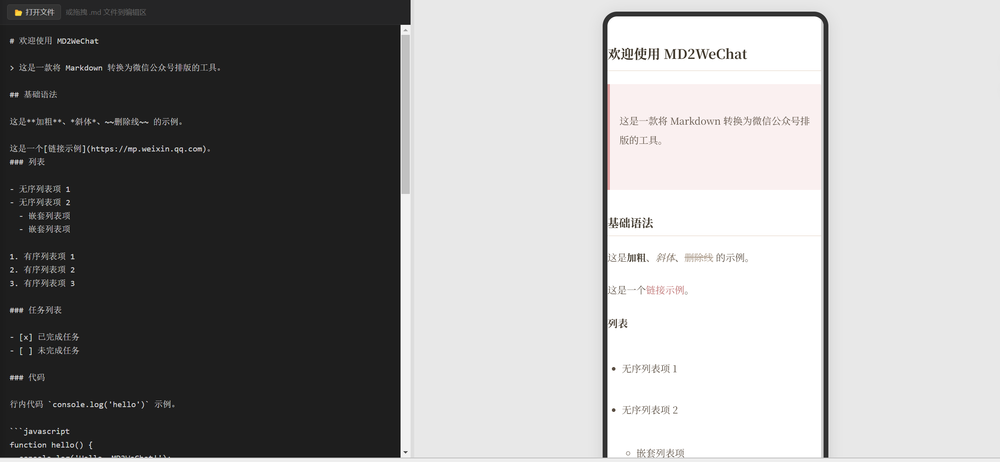

# MD2WeChat

> 📝 Markdown → 微信公众号排版工具

**写 Markdown，一键复制富文本，直接粘贴到公众号后台发布。**



[English Version](./README-en.md)

---

## ✨ 特性

- **实时预览** — 左侧写 Markdown，右侧手机模型实时渲染，延迟 <200ms
- **10 套精美主题** — 从极简到文艺，从商务到暗黑，一键切换
- **一键复制** — 生成带行内样式的富文本，粘贴到微信后台样式不丢失
- **暗黑模式预览** — 模拟微信夜间模式效果
- **本地历史记录** — 自动保存到 IndexedDB，不上传服务器
- **文件导入** — 支持打开 / 拖拽 .md 文件
- **公式 & 脚注** — 支持 LaTeX 数学公式和脚注语法
- **纯前端** — 无服务端，无数据上传，隐私安全

## 🚀 在线使用

https://md2wechathtml.netlify.app

## 🛠️ 本地开发

### 环境要求

- Node.js >= 18
- npm >= 9

### 安装 & 启动

```bash
# 克隆仓库
git clone https://github.com/TimFIV/md2wechathtml.git
cd md2wechat

# 安装依赖
npm install

# 启动开发服务器
npm run dev
```

打开浏览器访问 http://localhost:5173

### 构建

```bash
npm run build
```

构建产物在 `dist/` 目录下，可直接部署到任意静态托管服务。

## 🎨 主题列表

| 主题 | 风格 | 适用场景 |
|------|------|---------|
| 📄 默认纯净 | 经典白底黑字 | 通用文章 |
| 🌸 文艺浅调 | 衬线字体 + 淡粉引用块 | 散文随笔 |
| 📖 深阅读 | 羊皮纸色 + 墨绿标题 | 长文深度阅读 |
| 💼 商务简雅 | 深蓝主调 + 专业排版 | 商业分析 |
| ⚡ 科技极简 | GitHub 风格紧凑排版 | 技术文章 |
| 🎀 萌趣手账 | 圆润字体 + 奶油暖色 | 生活日记 |
| 🗞️ 灰度杂志 | 高对比黑白 + 衬线字体 | 杂志级排版 |
| 🌌 墨夜星辰 | 深空蓝紫 + 霓虹点缀 | 科技浪漫 |
| 🌿 森林日记 | 清新叶绿配色 | 旅行户外 |
| ☀️ 暖阳笔记 | 焦糖琥珀暖调 | 美食生活 |

## 📐 Markdown 语法支持

**基础语法**

- 标题 H1-H6
- 加粗、斜体、删除线
- 无序 / 有序列表
- 引用块
- 链接、图片占位符
- 行内代码、代码块
- 表格（自适应 + 斑马纹）
- 分割线
- 任务列表

**扩展语法**

| 语法 | 说明 |
|------|------|
| `$...$` | 行内数学公式 |
| `$$...$$` | 块级数学公式 |
| `[^1]` | 脚注 |
| `` | 视频占位卡片 |

## 🏗️ 技术栈

| 领域 | 方案 |
|------|------|
| 前端框架 | React 19 + TypeScript |
| 构建工具 | Vite 8 |
| Markdown 解析 | markdown-it + 插件 |
| 公式渲染 | KaTeX |
| 代码高亮 | Shiki |
| 本地存储 | IndexedDB (idb-keyval) |
| 复制实现 | Clipboard API + execCommand 降级 |

## 🤝 贡献

欢迎提交 Issue 和 PR！

1. Fork 本仓库
2. 创建特性分支 (`git checkout -b feature/xxx`)
3. 提交更改 (`git commit -m 'feat: xxx'`)
4. 推送分支 (`git push origin feature/xxx`)
5. 提交 Pull Request

## 📄 协议

[MIT](./LICENSE) © TimFIV
